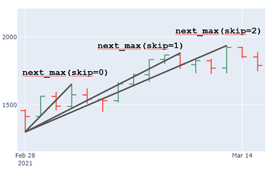

# 🌊 Elliott Wave Trading Bot

An advanced cryptocurrency trading bot that uses Elliott Wave Theory to analyze market patterns and generate automated trading signals on Binance Futures.

## 🚀 Features

- **Elliott Wave Pattern Recognition**: Advanced algorithm detecting 5-wave impulse patterns
- **Multi-Symbol Support**: Monitors 10 major cryptocurrency pairs
- **Multi-Timeframe Analysis**: Analyzes 15m, 30m, 1h, and 4h timeframes
- **Risk Management**: Configurable stop-loss, take-profit, and position sizing
- **Docker Deployment**: Ready for 24/7 cloud deployment
- **Real-time Monitoring**: Comprehensive logging and status tracking

## 📊 Supported Trading Pairs

- BTCUSDT, ETHUSDT, ADAUSDT, BNBUSDT
- SOLUSDT, DOGEUSDT, ATOMUSDT, DOTUSDT  
- LINKUSDT, AVAXUSDT

## 🎯 Trading Strategy

The bot uses Elliott Wave Theory principles:
- Identifies 5-wave impulse patterns
- Validates patterns against Elliott Wave rules
- Generates signals with confidence scoring
- Applies strict risk/reward filtering
- Executes trades with proper position sizing

## ⚙️ Configuration

### Signal Quality Settings
- **Min Confidence**: 45% (adjustable)
- **Min Risk/Reward**: 1.2:1 (adjustable)
- **Risk per Trade**: 2% of account balance
- **Max Positions**: 3 concurrent trades

### Enhanced Features
- Pattern detection on 40 symbol/timeframe combinations
- Conservative quality filters to prevent bad trades
- Real-time market condition validation
- Automatic error handling and recovery

## 🚀 Quick Start

### 1. Local Setup

```bash
# Clone the repository
git clone https://github.com/studiocz-dev/elies_wave_bot.git
cd elies_wave_bot

# Install dependencies
pip install -r requirements.txt

# Setup environment
cp .env.example .env
# Edit .env with your Binance API credentials

# Configure bot settings
python enhanced_bot_config.py

# Run the bot
python enhanced_elliott_wave_bot.py
```

### 2. Docker Deployment (Recommended)

```bash
# Local testing
docker-compose up -d

# Deploy to cloud (24/7 operation)
# See DOCKER_DEPLOYMENT.md for detailed instructions
```

## 🐳 Cloud Deployment (FREE Options)

The bot can run 24/7 in the cloud using free tiers:

- **Render.com**: 750 hours/month (24/7 coverage)
- **Railway.app**: 500 hours/month + $5 credit
- **Fly.io**: 3 shared VMs free

See [DOCKER_DEPLOYMENT.md](DOCKER_DEPLOYMENT.md) for complete deployment guide.

## 📋 Project Structure

```
elliott-wave-bot/
├── 📊 Core Trading System
│   ├── enhanced_elliott_wave_bot.py    # Main trading bot
│   ├── elliott_wave_trading_system.py  # Elliott Wave analysis
│   ├── binance_data_fetcher.py         # Market data retrieval
│   └── models/                         # Elliott Wave models
│
├── 🔧 Configuration
│   ├── enhanced_bot_config.py          # Configuration management
│   ├── bot_config.json                 # Trading parameters
│   └── .env.example                    # Environment template
│
├── 🐳 Docker Deployment
│   ├── Dockerfile                      # Container definition
│   ├── docker-compose.yml              # Local deployment
│   ├── railway.toml                    # Railway.app config
│   └── fly.toml                        # Fly.io config
│
├── 📖 Documentation
│   ├── DOCKER_DEPLOYMENT.md            # Deployment guide
│   ├── ENHANCEMENT_SUMMARY.md          # Feature overview
│   └── README.md                       # This file
│
└── 🧪 Testing & Scripts
    ├── test_enhanced_bot.py             # Bot testing
    ├── test_docker.bat                 # Docker testing (Windows)
    └── deploy.sh                       # Deployment script
```

## 🔐 Security Features

- Environment variable configuration (no hardcoded keys)
- Testnet support for safe testing
- IP whitelist support
- Secure Docker deployment
- No sensitive data in repository

## 📈 Performance

### Signal Generation
- **Previous**: ~0 signals/hour (60% confidence threshold)
- **Enhanced**: 2-5 signals/hour (45% confidence threshold)
- **Pattern Detection**: Increased from 25% to 40-50%

### Market Coverage
- **Symbols**: 10 (expanded from 4)
- **Timeframes**: 4 (expanded from 2)
- **Analysis**: 40 combinations every 5 minutes
- **Expected Improvement**: 400% more opportunities

## 🛠️ Configuration Options

### Preset Configurations
```python
# Aggressive (more signals)
config.create_aggressive_config()

# Conservative (higher quality)
config.create_conservative_config()

# Balanced (default)
# Current settings provide good balance
```

### Custom Settings
Edit `bot_config.json` for fine-tuning:
- Signal quality thresholds
- Risk management parameters
- Symbol selection
- Timeframe preferences

## 📊 Monitoring

### Real-time Logs
```bash
# Local Docker
docker-compose logs -f elliott-wave-bot

# Cloud platforms
# Use platform dashboard for log viewing
```

### Key Metrics Tracked
- Pattern detection rate
- Signal generation frequency
- Trade execution status
- Account balance changes
- System health status

## ⚠️ Risk Disclaimer

This trading bot is for educational and research purposes. Cryptocurrency trading involves substantial risk and may result in financial losses. Past performance does not guarantee future results. Always:

- Start with testnet/paper trading
- Use proper risk management
- Monitor bot performance regularly
- Never invest more than you can afford to lose

## 📄 License

This project is licensed under the MIT License.

## 🙏 Acknowledgments

- Elliott Wave Theory by Ralph Nelson Elliott
- Binance API for market data
- Docker community for containerization
- Open source trading community

---

**Happy Trading! 📈🚀**

> Built with ❤️ for the crypto trading community

# Algorithm / Idea
The basic idea of the algorithm is to try **a lot** of combinations of possible wave
patterns for a given OHLC chart and validate each one against a given
set of rules (e.g. against an 12345 impulsive movement).

# Class Structure
## MonoWave
The smallest element in a chart (or a trend) is called a MonoWave: 
The impulsive movement from a given low (or high) to the next high 
(or down to the low), where each candle (exactly: high / low) 
forms a new high (or new low respectively). 

The MonoWave ends, once a candle breaks this "micro trend".

There is `MonoWaveUp` and the `MonoWaveDown`, denoting the direction of the wave.

### WaveOptions
`WaveOptions` are a set of integers denoting how many of the (local) highs or lows should be
skipped to form a MonoWave.

### Parameters
The essential idea is, that with the parameter `skip=`, smaller corrections can be skipped. In case of an upwards trend, 
e.g. `skip=2` will skip the next 2 maxima.



## WavePattern
A `WavePattern` is the chaining of e.g. in case for an Impulse 5 `MonoWaves` (alternating between up and down direction). It is initialized with a list of `MonoWave`.

## WaveRule
`WavePattern` can be validated against a set of rules. E. g. form a valid 12345 impulsive waves, certain rules have to apply for the 
monowaves, e.g. wave 3 must not be the shortest wave, top of wave 3 must be over the top of wave 1 etc. 

Own rules can be created via inheritance from the base class. There are rules
implemented for 12345 Impulse. Leading Triangle and for ABC Corrections.

To create an own rule, the `.set_conditions()` method has to be implemented for every inherited rule. The method has a `dict`, having
arbitrarily named keys, having `{'waves': list 'function': ..., 'message': ...}` as value.

For `waves` you pass a list of waves which are used to validate a specific rule, e.g. `[wave1, wave2]`.

For `function` you use a `lambda` function to check, e.g. `lambda wave1, wave2: wave2.low > wave1.low`

For `message` you enter a message to display (in case `WavePattern(..., verbose=True)` is set).

Note that only if all rules in the `conditions` are `True` the whole `WaveRule` is valid.

### Check WavePattern against Rule
Once you have a `WavePattern` (chaining of 5 `MonoWave` for an impulse or 3 `MonoWave` for a correction)
 You can check against a `WaveRule` via the `.check_rule(waverule: WaveRule)` method.

## WaveCycle
A `WaveCycle` is the combination of an impulsive (12345) and a corrective (ABC) movement.
Not working atm.

## WaveAnalyzer
Is used to find impulsive and corrective movements.
Not working atm.

### WaveOptionsGenerator
There are three `WaveOptionsGenerators` available at the moment to fit the needs for creating
tuples of 2, 3 and 5 integers (for a 12 `TDWave`, an ABC `Correction` and a 12345 `Impulse`).

The generators already remove invalid combinations, e.g. [1,2,0,4,5], as after selecting the next minimum (3rd index is 0), for the 4th and 5th wave skipping is not allowed.

As unordered sets are used, the generators have the `.options_sorted` property to go from low numbers to high ones. This means that
first, the shortest (time wise) movements will be found.

## Helpers
Contains some plotting functions to plot a `MonoWave` (a single movement), a `WavePattern` (e.g. 12345 or ABC) and a `WaveCycle` (12345-ABC).

# Plotting
For different models there are plotting functions. E.g. use `plot_monowave` to plot a `MonoWave` instance or `plot_pattern` for a `WavePattern`.
